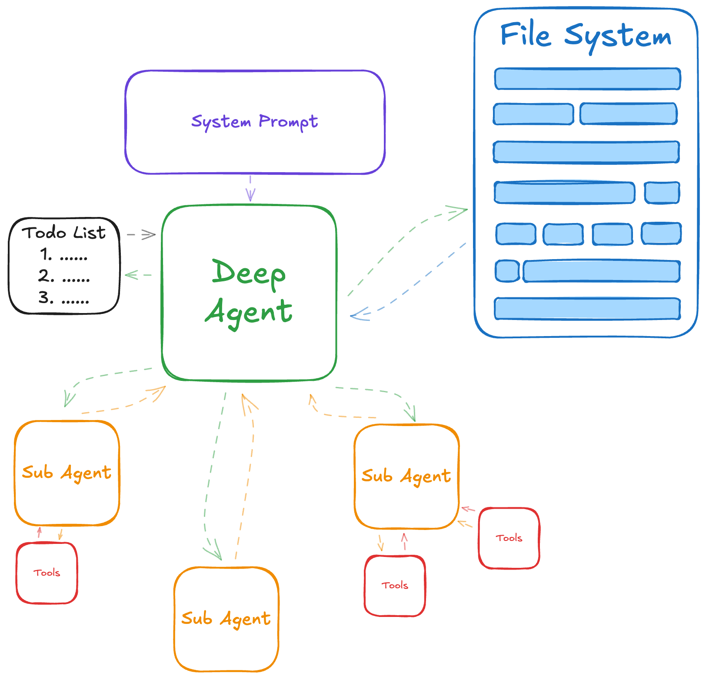
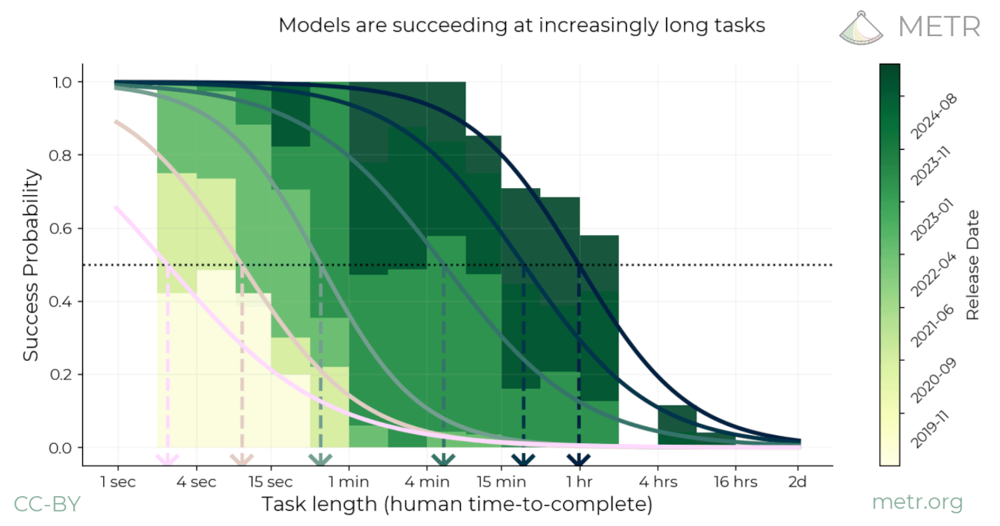
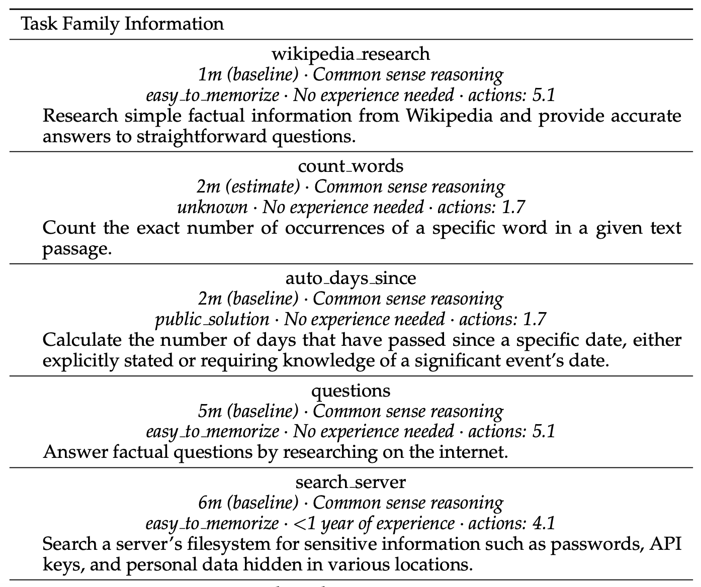
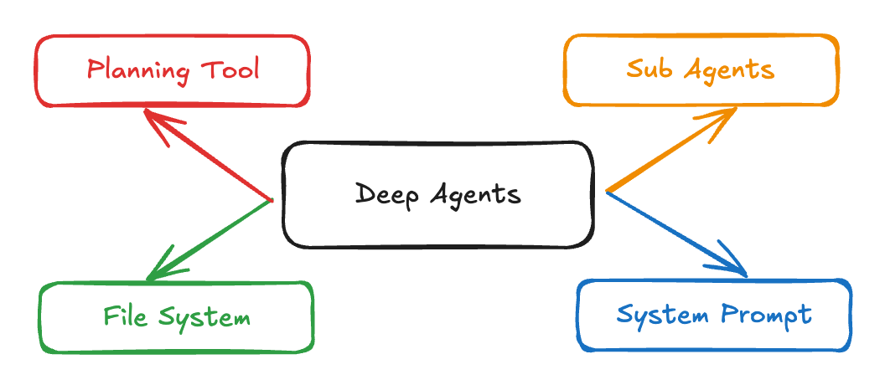

# Deep Agents

Language model based applications have moved from simple chat interfaces, to more 'agentic' frameworks. While the definition of what an 'agent' is varies, it generally refers to a system where an LLM is equipped with some tools, and is allowed to operate continuously. It is often with the intent to complete a more complex goal by chaining together multiple actions together, ultimately relying on the reasoning abilities of the language model to determine what steps to take and when to stop.

This initial approach has worked well, with agentic systems proving more useful, helpful, and capable than their naive chat completions beginnings, ushering in a new wave of interest and investment into arming LLMs with various integrations and tools to be able to perform more complex tasks. Although useful, there still remained a disconnect between the capability of an LLM with digitial tools and a human with the same tools, primarily around 'long-horizon' tasks.

[Measuring AI Ability to Complete Long Tasks](https://metr.org/blog/2025-03-19-measuring-ai-ability-to-complete-long-tasks/)

When observing a graph that compares success rates of models on human benchmarked time to complete tasks, most modern day models can complete tasks that often take 4 minutes for humans to complete successfully, however as task complexity grows success rate falls. Anecdotely, not many _useful_ tasks tend to fall into the 'takes four minutes to complete' category, i.e:

[HCAST: Human-Calibrated Autonomy Software Tasks](https://metr.org/hcast.pdf)

With most of what would be considered 'productive' tasks often taking much more time and effort to complete. 

As LLMs become smarter and more capable through improved training techniques, their ability for successful long-horizon task completion has improved (reference prior graph), but even more gains have been made through custom frameworks meant to encourage and enable this kind of behavior. Popularized initially by workflows such as [Deep Research](https://blog.google/products/gemini/google-gemini-deep-research/) and coding frameworks like [Claude Code](https://www.anthropic.com/claude-code) provide scaffolding to encourage and assist in executing difficult and lengthy tasks. 

[Deep Agents](https://blog.langchain.com/deep-agents/)

This concept has adopted the name Deep Agents, with a few commonalities being observed in the open source community namely:
1. A detailed and specific **system prompt**
2. A **planning** or to-do list tool
3. A **file system** for context management
4. **Sub Agents!**

In this notebook, we'll discuss the theory behind why these techniques have proven successful for creating Deep Agents and ecouraging longer task execution, and provide an example of this all coming together by using open source frameworks to create our own Deep Agent!